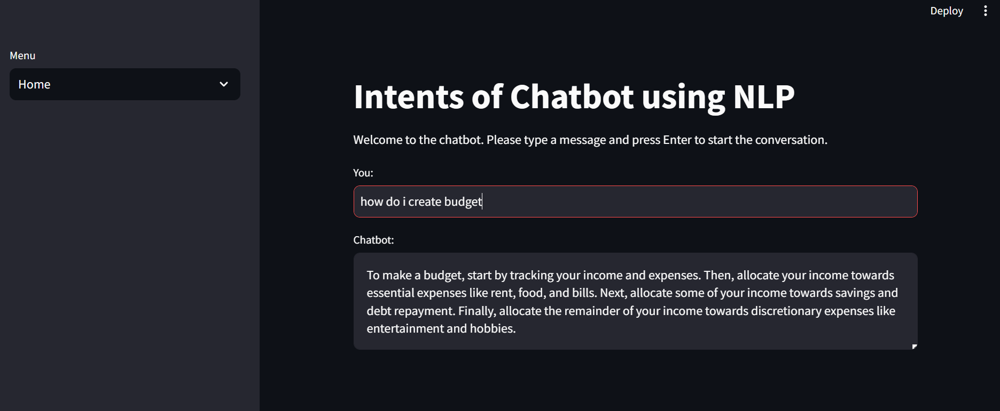
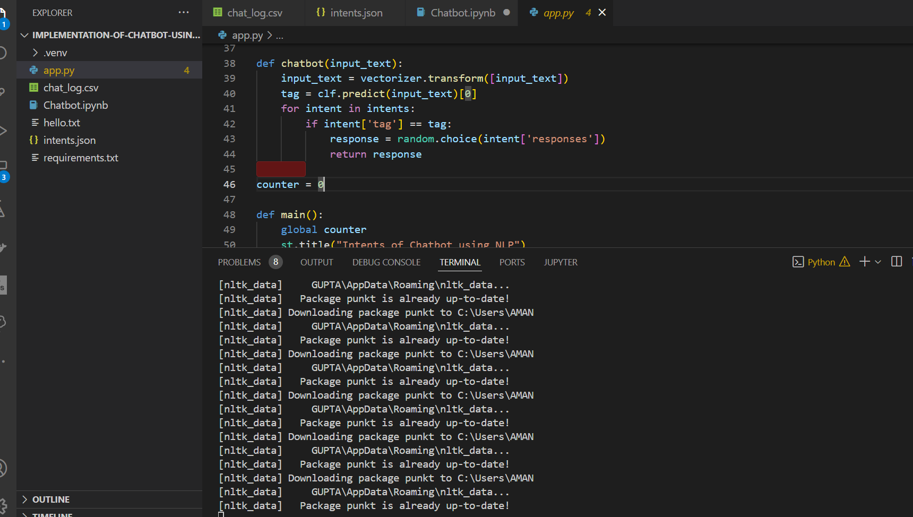

# Chatbot Using NLP

This project implements a chatbot using Natural Language Processing (NLP) techniques. The chatbot is designed to understand user intents and provide appropriate responses based on predefined patterns and responses. It utilizes the NLTK library for NLP, Scikit-learn for machine learning, and Streamlit for creating an interactive web interface.

## Features

- Understands various user intents such as greetings, farewells, gratitude, and more.
- Provides relevant responses based on user input.
- Maintains a conversation history that can be viewed by the user.
- Built using Python and leverages popular libraries for NLP and machine learning.

## Technologies Used

- Python
- NLTK
- Scikit-learn
- Streamlit
- JSON for intents data

## Installation

### 1. Clone the Repository

```bash
git clone <repository-url>
cd <repository-directory>
```

### 2. Create a Virtual Environment (Optional but Recommended)

```bash
python -m venv venv
source venv/bin/activate  # On Windows use `venv\Scripts\activate`
```

### 3. Install Required Packages

```bash
pip install -r requirements.txt
```

### 4. Download NLTK Data

```python
import nltk
nltk.download('punkt')
```

## Usage

To run the chatbot application, execute the following command:

```bash
streamlit run app.py
```

Once the application is running, you can interact with the chatbot through the web interface. Type your message in the input box and press Enter to see the chatbot's response.

## Intents Data

The chatbot's behavior is defined by the `intents.json` file, which contains various tags, patterns, and responses. You can modify this file to add new intents or change existing ones.

## Conversation History

The chatbot saves the conversation history in a CSV file (`chat_log.csv`). You can view past interactions by selecting the "Conversation History" option in the sidebar.

## Snapshots

### 1. Chatbot User Interface

This is a snapshot of the chatbot user interface where users can interact with the bot.


### 2. Conversation History

Here is a snapshot of the conversation history feature, where users can view their previous interactions.



### 3. Code Structure

The code structure and output generated by the chatbot are displayed below.



## Contributing

Contributions to this project are welcome! If you have suggestions for improvements or features, feel free to open an issue or submit a pull request.

## License

This project is licensed under the MIT License. See the LICENSE file for details.

## Acknowledgments

- NLTK for natural language processing.
- Scikit-learn for machine learning algorithms.
- Streamlit for building the web interface.
